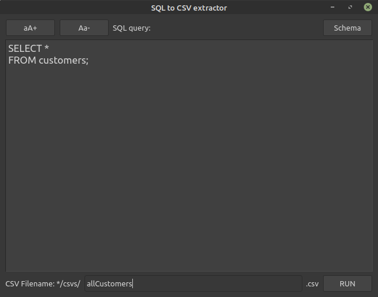
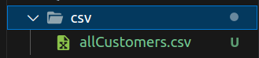
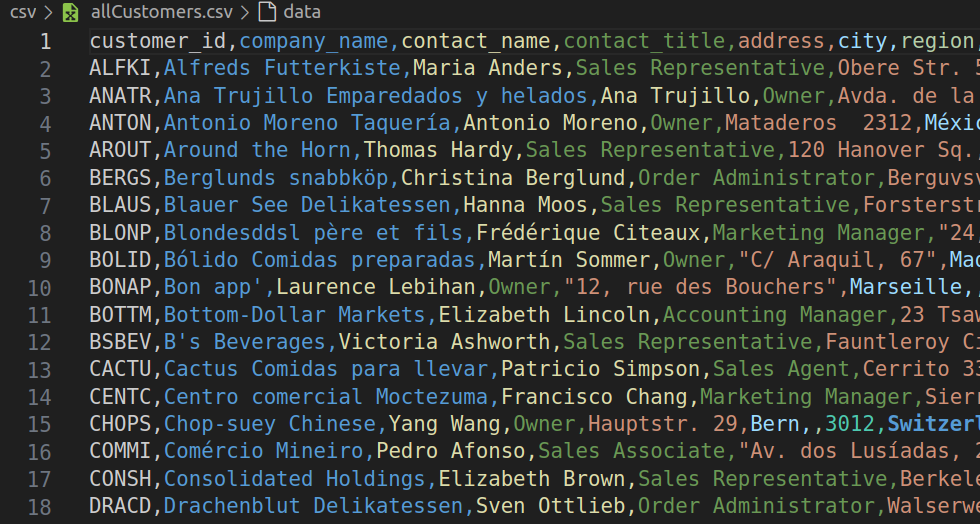
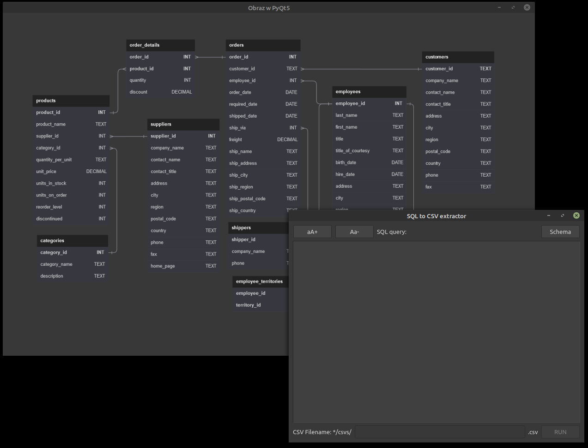
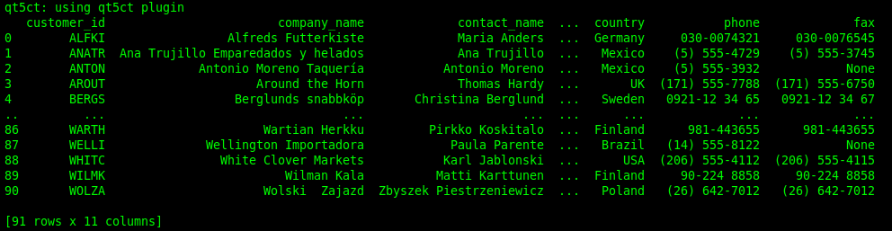

# da-sql-to-csv-extractor

## About
Data Analytics project including Postgres Docker server, Northwind DB, Python, PyQt5 to create csv files based on sql queries.

### Main window


- create csv folder and csv file



- CSV data file from Northwind SQL database



- Scalable DB schema, as helper



- console log, to show pandas DataFrame




## How to use

- install docker
- install python3+
- run docker with Northwind database [more here](/docker_files/README.md)

```python
# run the app
python3 main.py
```